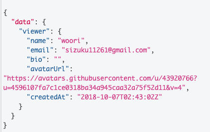
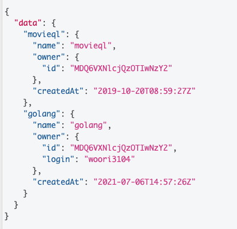
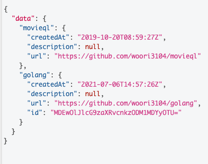
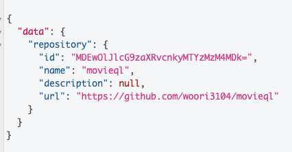

## 6. Queries in GraphQL
```
query { 
  viewer { 
    id
    name
    email
    bio
    avatarUrl
    createdAt
  }
}
```


## 7. Arguments in GraphQL
```
query { 
  repository(name:"movieql", owner:"woori3104") {
    createdAt
  }
}
```


## 8. Aliases in GraphQL
```

# Type queries into this side of the screen, and you will 
# see intelligent typeaheads aware of the current GraphQL type schema, 
# live syntax, and validation errors highlighted within the text.

# We'll get you started with a simple query showing your username!

query { 
  movieql : repository(name:"movieql", owner:"woori3104") {
    name
    owner {
      id
    },
    createdAt
  }
  golang :repository(name:"golang", owner:"woori3104") {
    name,
    owner {
      id,
      login
    },
    createdAt
  }
}
```


## 10. Fragments in GraphQL
```
query { 
  movieql : repository(name:"movieql", owner:"woori3104") {
    ...RepositoryCommonField
  }
  golang :repository(name:"golang", owner:"woori3104") {
   ...RepositoryCommonField
    id
  }
}

fragment RepositoryCommonField on Repository {
  createdAt
  description
  url
}

```


## 11. Variables in GraphQL
```
query movieql($name:String! $owner:String!) { 
  repository(name:$name, owner:$owner) {
    id
    name
    description
    url
  }
}

Query Variables
{
  "name": "movieql",
  "owner": "woori3104"
}
```


## 12. Mutation

|          | REST API | GraphQL  |
|----------|----------|----------|
| Read     | Get      | Query    |
| Greate   | Post     | Mutation |
| Update   | Put      | Mutation |
| Delete   | Delete   | Mutation |

```
mutation AddProject($Input:CreateProjectInput!){
  createProject(input:$Input) {
    clientMutationId
    project {
      id
      createdAt
      url
    }
  }
}

Query Varibles 
{
  "Input": {
    "ownerId": "---",
    "name": "GraphQL Project", 
    "body": "I'm trying ", 
    "clientMutationId": "12345678"
    
  }
```
